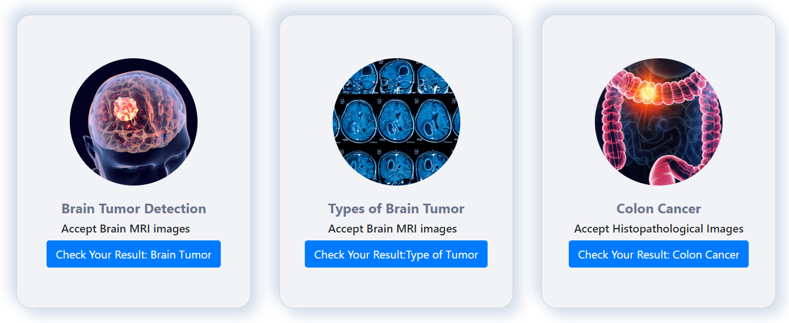
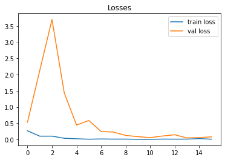
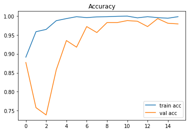
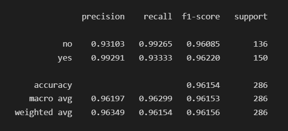
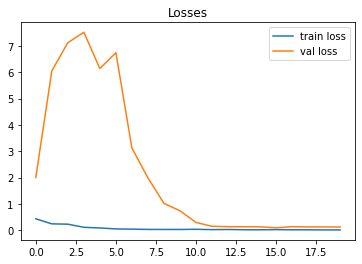
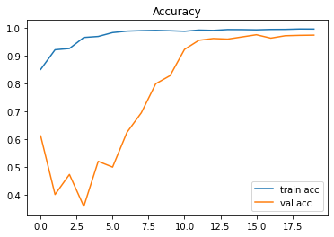
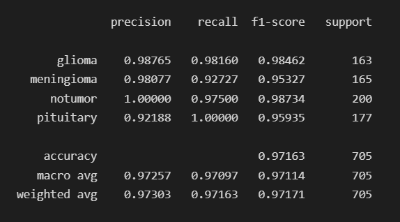
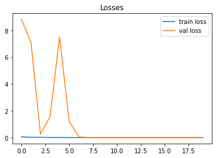
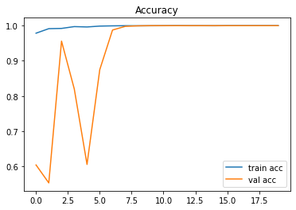
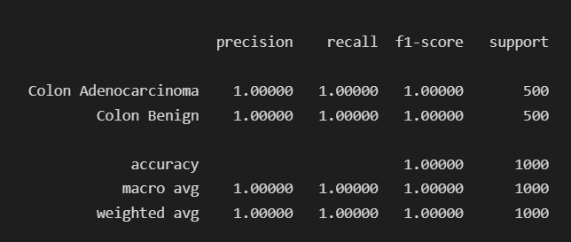

# <strong>Use case of Computer Vision on Medical Domain</strong>

This is an implementation of computer vision. I have done it from my own interest.

## <strong>Tech Stack</strong>

* Python, CNN, Computer Vision with Pretrained model, Flask

## <strong>Demo</strong>

# <strong>About</strong>

Binary and multiclass classification is used. 3 classification task user can perfrom here.

* Brain Tumor detection

Here user can detect if mri has tumor or not. Brain MRI scan is needed for this task. This is a binary classification task.

* Types of Brain Tumor

This model can detect if any Brain MRI scan has a tumor or not. If it contains a tumor then the type of tumor it has. This model can classify 3 types of brain tumors glioma, meningioma, and pituitary.

* Colon Cancer

This is binary classification. This model can detect Colon Benign and Colon Adenocarcinoma from histopathological images of olorectal cancer.

# <strong>Deployment</strong>

You check it here. (project is still going on.)

# <strong>Datasets</strong>

All datasets are taken from Kaggle.

Datasets are divided into 3 catagories. Train, Valid and Test.

# <strong>Codes and Training</strong>

Pretrained model Mobilenet V2 is used for the training process. Only 20 epochs is used.

All codes are available on the notebooks folder. Training process has been done on google colab.

# Evalution Matrix

> Brain Tumor

Loss & Accuracy

   

Evalution Matrix

> Types of brain tumor

Loss & Accuracy

   

Evalution Matrix

> Colon

Loss & Accuracy

   

Evalution Matrix

# Conclusion

This is an experimental project. Higher accuracy can be achieved easily.

Another point is that a very low number of samples are used in this experiment. So accuracy and prediction will not be the same as the experiment in the real world. Feel free to give your suggestions to this email sshuvo548@gmail.com

## Developer
Backend & Experiment: Shuvo Saha Roy

Frontend : Dipkor Emon

## License

[MIT](https://choosealicense.com/licenses/mit/)
